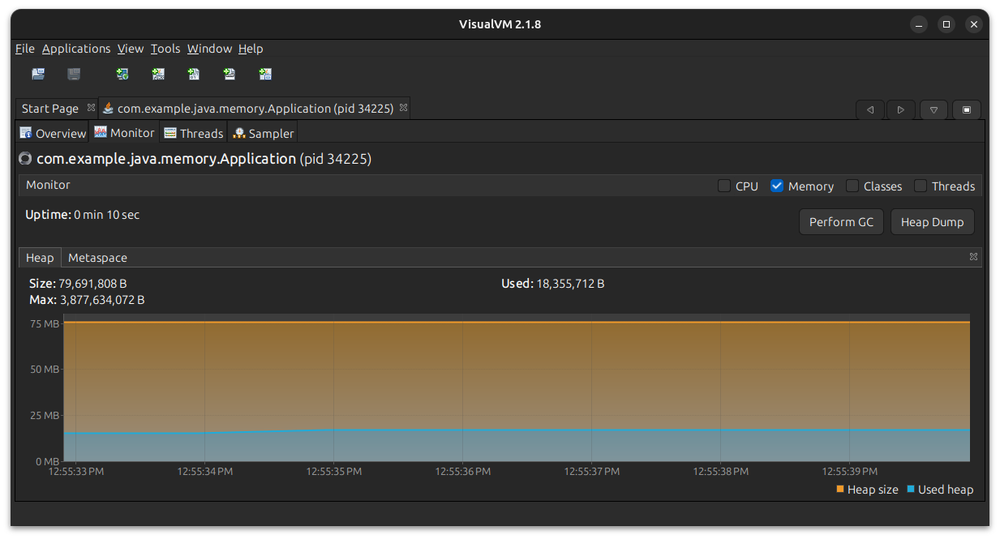
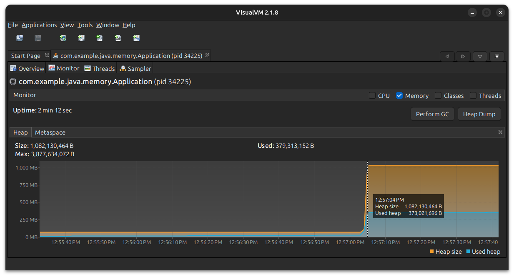
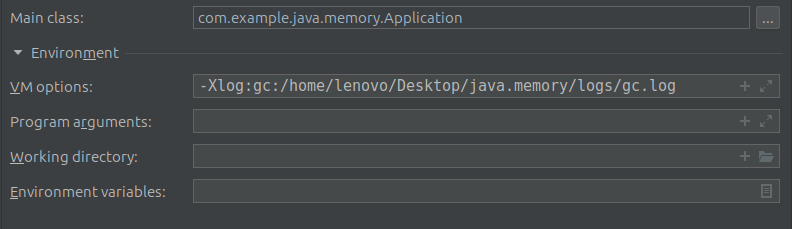
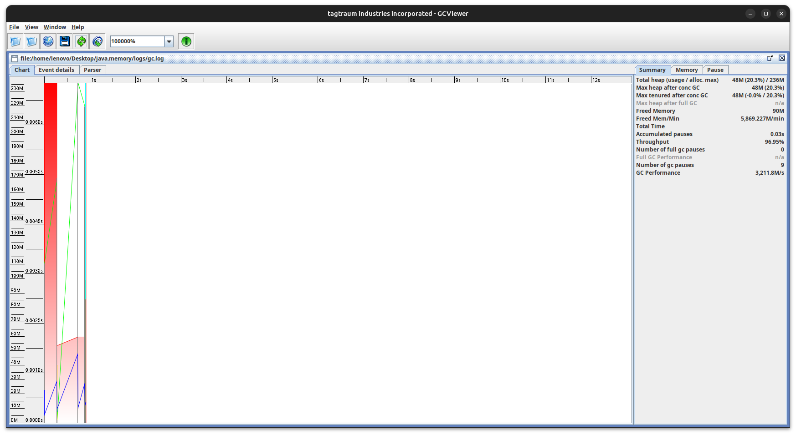

# JavaMemory


## Кейсы с неправильным использованием памяти

Для отображения использования памяти, работы Garbage Collector будем использовать [VisualVM](https://visualvm.github.io/download.html). Для визуализации логов [GCViewer](https://github.com/chewiebug/GCViewer/wiki/Changelog).

### Static поля

Создадим класс Leak, который будет добавлять в статический список множество элементов:

```java
public class Leak {

    private static final List<Double> leaks = new ArrayList<>();

    public void addNumbers() {
        for (int i = 0; i < 10_000_000; ++i) {
            leaks.add(Math.random());
        }
    }

}
```

Для удобства используем плагин в IntelliJ Idea [VisualVM](https://plugins.jetbrains.com/plugin/7115-visualvm-launcher/):

Так же эндпоинт, который вызывает метод addNumbers:

```java
@RestController
public class SimpleController {

    @GetMapping
    public void leak() {
        Leak leak = new Leak();
        leak.addNumbers();
    }

}
```

Запускаем приложение, смотрим распределение памяти до вызова метода addNumbers():



После вызова localhost:8080:



Видно, что сборщик мусора не освобождает память, так как static поля действуют на **протяжении всего действия приложения**

#### Работа с логами и их визуализация

Для того, чтобы вывод работы Garbage Collector записывался в логи необходимо прописать следующий VM options:



Примерное содержимое файла:

```bash
[0.005s][info][gc] Using G1
[0.753s][info][gc] GC(0) Pause Young (Normal) (G1 Evacuation Pause) 23M->6M(236M) 5.732ms
[1.148s][info][gc] GC(1) Pause Young (Concurrent Start) (CodeCache GC Threshold) 31M->8M(236M) 7.941ms
[1.148s][info][gc] GC(2) Concurrent Mark Cycle
[1.156s][info][gc] GC(2) Pause Remark 10M->10M(54M) 2.140ms
[1.158s][info][gc] GC(2) Pause Cleanup 10M->10M(54M) 0.110ms
[1.159s][info][gc] GC(2) Concurrent Mark Cycle 10.854ms
[2.142s][info][gc] GC(3) Pause Young (Prepare Mixed) (G1 Evacu
```

Для визуализации логов будем использовать [GCViewer](https://github.com/chewiebug/GCViewer/wiki/Changelog)

Запуск GCViewer:

```bash
java -jar {GCVIEWER_FILENAME}.jar
```

Находим наш лог, полуаем следующий картину:



## References

Благодарность этому [материалу](https://www.youtube.com/watch?v=IUUoMVaXzas)
